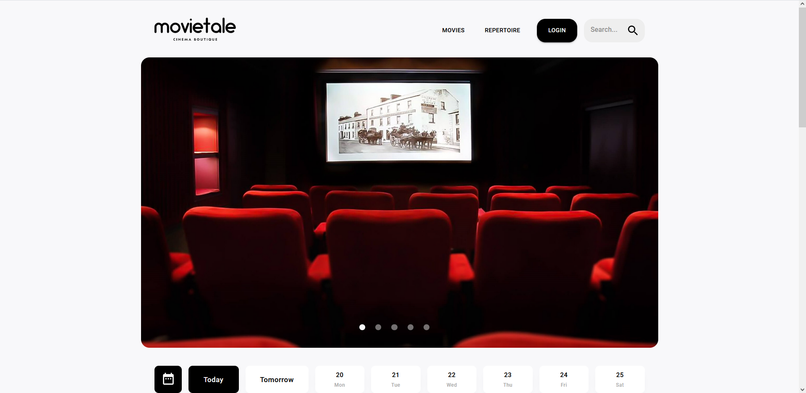
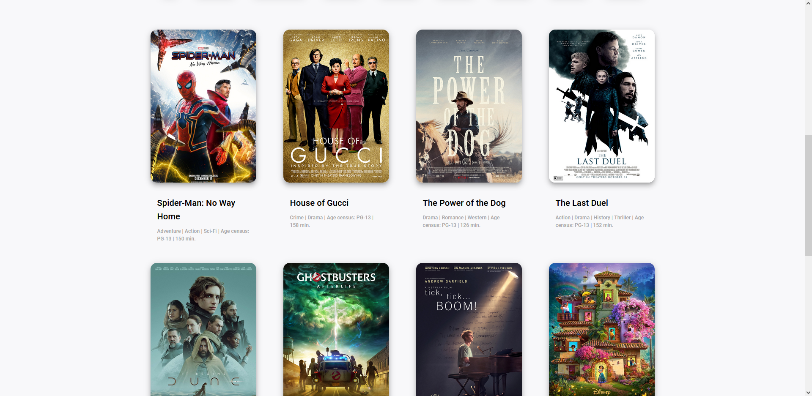
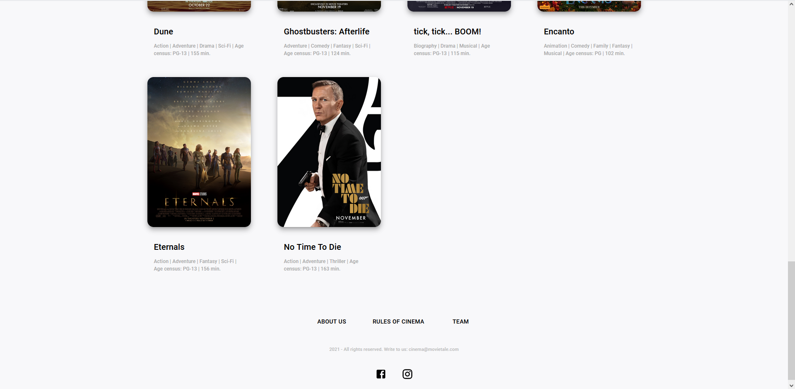

## Movietale

<h3 align="center">
    Home Page
</h3>

----
### Description
**Movietale** is a website for a small rural movie theatre. The client wanted to have a website to inform the 
customers about featured movies, upcoming movies and show times. It was developed for **CSC3131** module at 
*Newcastle University*.

### Installation
Coming soon...

### Usage
Coming soon...

#### Admin details
Email: movietale@support.com  
Password: bestadminpassword123  

### License
This project is licensed under the [MIT License](https://choosealicense.com/licenses/mit/) see the LICENSE.md file
for more details.